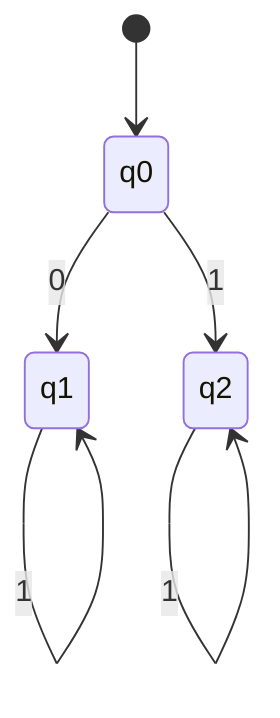
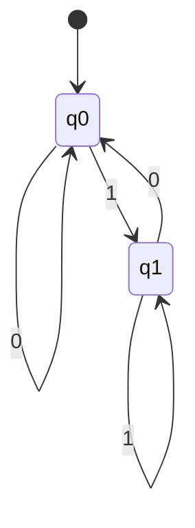
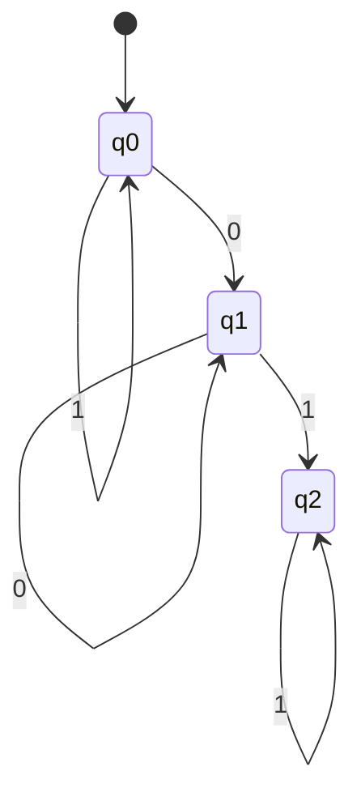
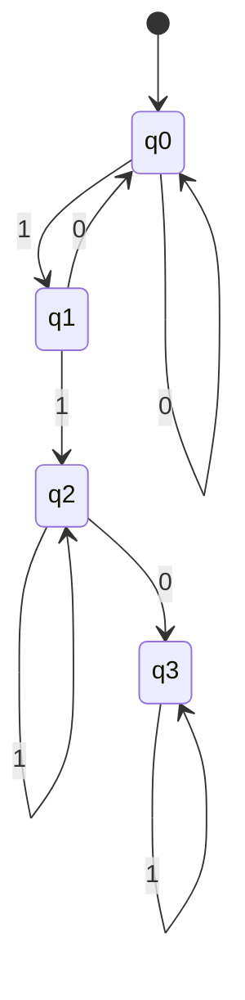
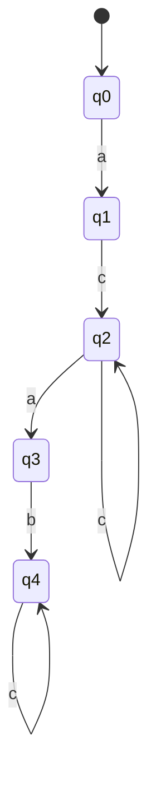
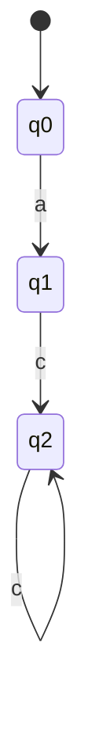
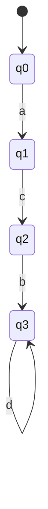
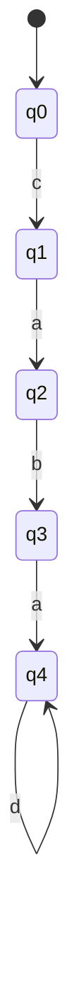
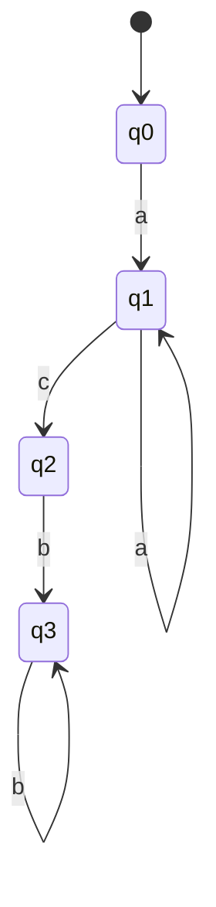
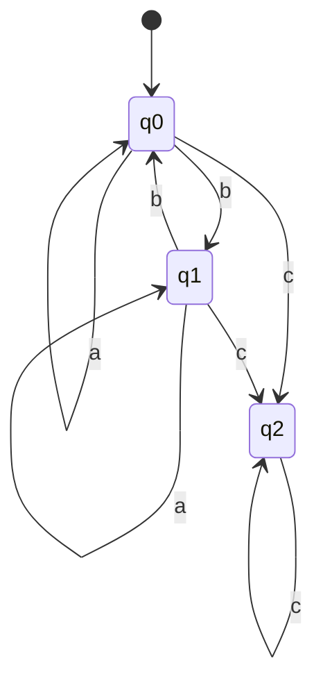

  

# REPORTE DE PRÁCTICA NO. 2

## Práctica 2. Reconocimiento de palabras con Autómatas Finitos Deterministas

 

### ALUMNO  
Arrazola Ibarra Juan Pablo

 

Licenciatura en Ciencias Computacionales  
Instituto de Ciencias Básicas e Ingeniería (ICBI)  
Universidad Autónoma del Estado de Hidalgo  

  

2026

---

# Introducción

Un Autómata Finito Determinista (AFD) es un modelo matemático utilizado en la teoría de la computación para reconocer lenguajes formales. Este tipo de autómata permite analizar cadenas de símbolos pertenecientes a un alfabeto determinado y decidir si dichas cadenas pertenecen o no a un lenguaje específico.

Un AFD se define como una tupla:

AFD = (Σ, Q, δ, q0, F)

donde:

Σ es el alfabeto de entrada.  
Q es el conjunto finito y no vacío de estados.  
δ es la función de transición δ: Q × Σ → Q.  
q0 es el estado inicial.  
F es el conjunto de estados finales o de aceptación.

Sea A = (Σ, Q, δ, q0, F) un AFD y sea w una cadena de símbolos pertenecientes al alfabeto Σ. El autómata acepta la cadena si existe una secuencia de estados que inicia en el estado inicial y termina en uno de los estados de aceptación después de procesar todos los símbolos de la cadena.

Los Autómatas Finitos Deterministas son utilizados en diversas áreas de la informática, como el diseño de compiladores, el análisis léxico, el reconocimiento de patrones y el procesamiento de lenguajes formales.

---

# Marco teórico

La teoría de autómatas estudia modelos abstractos de máquinas capaces de reconocer lenguajes formales. Dentro de estos modelos se encuentran los Autómatas Finitos Deterministas, los cuales se caracterizan por tener un conjunto finito de estados y por poseer una única transición posible para cada símbolo de entrada en cada estado.

Una tabla de transición de estados muestra a qué estado se moverá un autómata dependiendo del estado actual y del símbolo que se procese. Esta tabla permite representar de forma estructurada el comportamiento del autómata.

De manera complementaria, se utilizan diagramas de transición de estados para representar gráficamente el funcionamiento del autómata. En estos diagramas, cada nodo representa un estado y cada flecha representa una transición entre estados.

El estado inicial se representa mediante una flecha que no tiene nodo de origen, mientras que los estados finales se representan mediante un doble círculo. Las transiciones entre estados se etiquetan con el símbolo de entrada que provoca el cambio de estado.

Estas representaciones permiten comprender con mayor claridad el comportamiento del autómata y facilitan el análisis de las cadenas que pertenecen o no al lenguaje definido.

---

# Objetivos

## Objetivo general

Construir Autómatas Finitos Deterministas (AFD) para reconocer palabras de un lenguaje L mediante la definición de tablas de transición de estados, diagramas de transición de estados y simulaciones.

## Objetivos específicos

- Implementar Autómatas Finitos Deterministas (AFD).
- Construir tablas de transición de estados.
- Construir diagramas de transición de estados.
- Realizar la simulación de AFD para validar palabras válidas y no válidas en el lenguaje.

---

# Desarrollo

En esta sección se desarrollan los ejercicios planteados en la práctica.  
Para cada ejercicio se definieron los siguientes elementos:

1. Tupla del AFD  
2. Tabla de transición de estados  
3. Diagrama de transición de estados  
4. Simulación con palabras aceptadas y rechazadas

Las simulaciones fueron realizadas utilizando el simulador de autómatas disponible en:

https://automatonsimulator.com/

# Ejercicio 1
L = {0x | x ∈ {0,1}*}

## Tupla
AFD = (Σ,Q,δ,q0,F)  
Σ = {0,1}  
Q = {q0,q1,q2}  
q0 = inicial  
F = {q1}

## Tabla de transición

| Estado | 0 | 1 |
|------|------|------|
| q0 | q1 | q2 |
| q1 | q1 | q1 |
| q2 | q2 | q2 |

## Palabras aceptadas (5 transiciones)
00000  
01010  
01111  
00101  
01001  

## Palabras rechazadas (5 transiciones)
10000  
11111  
10101  
11010  
10011  

---

# Ejercicio 2
L = {x1 | x ∈ {0,1}*}

## Tupla
AFD = (Σ,Q,δ,q0,F)  
Σ = {0,1}  
Q = {q0,q1}  
q0 = inicial  
F = {q1}

## Tabla de transición

| Estado | 0 | 1 |
|------|------|------|
| q0 | q0 | q1 |
| q1 | q0 | q1 |

## Palabras aceptadas (5 transiciones)
00001  
01011  
10101  
11111  
00111  

## Palabras rechazadas (5 transiciones)
00000  
11110  
10110  
01010  
11000  

---

# Ejercicio 3
L = {x01y}

## Tupla
AFD = (Σ,Q,δ,q0,F)  
Σ = {0,1}  
Q = {q0,q1,q2}  
q0 = inicial  
F = {q2}

## Tabla de transición

| Estado | 0 | 1 |
|------|------|------|
| q0 | q1 | q0 |
| q1 | q1 | q2 |
| q2 | q2 | q2 |

## Palabras aceptadas (5 transiciones)
00111  
10110  
01010  
11010  
00011  

## Palabras rechazadas (5 transiciones)
11111  
00000  
11110  
10000  
11000  

---

# Ejercicio 4
L = {x110y}

## Tupla
AFD = (Σ,Q,δ,q0,F)  
Σ = {0,1}  
Q = {q0,q1,q2,q3}  
q0 = inicial  
F = {q3}

## Tabla de transición

| Estado | 0 | 1 |
|------|------|------|
| q0 | q0 | q1 |
| q1 | q0 | q2 |
| q2 | q3 | q2 |
| q3 | q3 | q3 |

## Palabras aceptadas (5 transiciones)
11101  
01101  
11011  
11100  
01110  

## Palabras rechazadas (5 transiciones)
00000  
10101  
01010  
00111  
10001  

---

# Ejercicio 5
L = {acxab}

## Tupla
AFD = (Σ,Q,δ,q0,F)  
Σ = {a,b,c}  
Q = {q0,q1,q2,q3,q4}  
q0 = inicial  
F = {q4}

## Tabla de transición

| Estado | a | b | c |
|------|------|------|------|
| q0 | q1 | - | - |
| q1 | - | - | q2 |
| q2 | q3 | q2 | q2 |
| q3 | - | q4 | - |
| q4 | q4 | q4 | q4 |

## Palabras aceptadas (5 transiciones)
acaab  
acbab  
accab  
acabb  
acacb  

## Palabras rechazadas (5 transiciones)
abcab  
cabaa  
aacbb  
bcaba  
ccbab  

---

# Ejercicio 6
L = {acxz | z ≠ ab}

## Tupla
AFD = (Σ,Q,δ,q0,F)  
Σ = {a,b,c}  
Q = {q0,q1,q2,q3}  
q0 = inicial  
F = {q2}

## Tabla de transición

| Estado | a | b | c |
|------|------|------|------|
| q0 | q1 | - | - |
| q1 | - | - | q2 |
| q2 | q2 | q2 | q2 |
| q3 | q3 | q3 | q3 |

## Palabras aceptadas (5 transiciones)
acaaa  
acbca  
acccc  
acbcb  
accaa  

## Palabras rechazadas (5 transiciones)
acaab  
acbab  
accab  
acabb  
acacb  

---

# Ejercicio 7
L = {acbxz | z ≠ bd}

## Tupla
AFD = (Σ,Q,δ,q0,F)  
Σ = {a,b,c,d}  
Q = {q0,q1,q2,q3}  
q0 = inicial  
F = {q3}

## Tabla de transición

| Estado | a | b | c | d |
|------|------|------|------|------|
| q0 | q1 | - | - | - |
| q1 | - | - | q2 | - |
| q2 | - | q3 | - | - |
| q3 | q3 | q3 | q3 | q3 |

## Palabras aceptadas (5 transiciones)
acbaa  
acbcc  
acbda  
acbbb  
acbca  

## Palabras rechazadas (5 transiciones)
acbbd  
acabd  
acdbd  
acabd  
acbbd  

---

# Ejercicio 8
L = {cabaxz | z ≠ ab}

## Tupla
AFD = (Σ,Q,δ,q0,F)  
Σ = {a,b,c,d}  
Q = {q0,q1,q2,q3,q4}  
q0 = inicial  
F = {q4}

## Tabla de transición

| Estado | a   | b   | c   | d   |
| ------ | --- | --- | --- | --- |
| q0     | -   | -   | q1  | -   |
| q1     | q2  | -   | -   | -   |
| q2     | -   | q3  | -   | -   |
| q3     | q4  | -   | -   | -   |
| q4     | q4  | q4  | q4  | q4  |

## Palabras aceptadas (5 transiciones)
cabaa  
cabac  
cabda  
cabbb  
cabca  

## Palabras rechazadas (5 transiciones)
cabab  
cabdab  
cababb  
cabacb  
cababb  

---

# Ejercicio 9
L = {aⁿcbᵐ | n>0 , m>0}

## Tupla
AFD = (Σ,Q,δ,q0,F)  
Σ = {a,b,c}  
Q = {q0,q1,q2,q3}  
q0 = inicial  
F = {q3}

## Tabla de transición

| Estado | a | b | c |
|------|------|------|------|
| q0 | q1 | - | - |
| q1 | q1 | - | q2 |
| q2 | - | q3 | - |
| q3 | - | q3 | - |

## Palabras aceptadas (5 transiciones)
aacbb  
acbbb  
aaacb  
aaabb  
aacbb  

## Palabras rechazadas (5 transiciones)
aaaaa  
ccccc  
bbbba  
acaaa  
bbbbb  

---

# Ejercicio 10
L = {x cᵐ | x ∈ {a,b}* y número de b es par}

## Tupla
AFD = (Σ,Q,δ,q0,F)  
Σ = {a,b,c}  
Q = {q0,q1,q2}  
q0 = inicial  
F = {q0,q2}

## Tabla de transición

| Estado | a | b | c |
|------|------|------|------|
| q0 | q0 | q1 | q2 |
| q1 | q1 | q0 | q2 |
| q2 | q2 | q2 | q2 |

## Palabras aceptadas (5 transiciones)
aabcc  
abbcc  
aaacc  
bbccc  
aabbc  

## Palabras rechazadas (5 transiciones)
abccc  
bcccc  
abbca  
bbcab  
abcac  

---

# Resultados

Durante la realización de la práctica se construyeron diferentes Autómatas Finitos Deterministas para reconocer distintos lenguajes definidos sobre diversos alfabetos. Para cada ejercicio se definieron los estados del autómata, la función de transición y los estados de aceptación.

Las tablas de transición permitieron representar de manera organizada el comportamiento de cada autómata, mientras que los diagramas de estados facilitaron la visualización de las transiciones entre estados.

Posteriormente, mediante el uso del simulador de autómatas se realizaron pruebas con diferentes cadenas de entrada para verificar si eran aceptadas o rechazadas por el autómata. Esto permitió confirmar que los autómatas construidos reconocen correctamente las cadenas que pertenecen al lenguaje definido.

---

# Cuestionario

## ¿Cuáles son los elementos que definen un AFD?

Un Autómata Finito Determinista se define mediante una tupla formada por cinco elementos: el alfabeto de entrada (Σ), el conjunto de estados (Q), la función de transición (δ), el estado inicial (q0) y el conjunto de estados finales o de aceptación (F).

---

## ¿Cuál es la utilidad de una tabla de transiciones de estado de un AFD?

La tabla de transiciones permite representar de forma clara y organizada el comportamiento del autómata. En ella se indica a qué estado se moverá el autómata dependiendo del estado actual y del símbolo de entrada que se procese.

---

## ¿Qué importancia tienen los diagramas de transición de estado en el proceso de construcción de un AFD?

Los diagramas de estados permiten visualizar gráficamente el funcionamiento del autómata. Gracias a ellos es más sencillo comprender cómo se realizan las transiciones entre estados y cómo se procesan las cadenas de entrada dentro del autómata.

---

## ¿Cuáles son las ventajas de la simulación del AFD?

La simulación permite comprobar el funcionamiento del autómata antes de su implementación. A través de ella se pueden probar diferentes cadenas de entrada y verificar si son aceptadas o rechazadas por el autómata, lo que ayuda a detectar posibles errores en el diseño.

---

# Conclusiones

Los Autómatas Finitos Deterministas representan una herramienta fundamental dentro de la teoría de la computación para el reconocimiento de lenguajes formales. A través de la definición de estados y transiciones es posible modelar sistemas que procesan cadenas de símbolos de manera estructurada.

Durante esta práctica se logró comprender el funcionamiento de los AFD mediante la construcción de diferentes autómatas, la elaboración de tablas de transición y la representación gráfica mediante diagramas de estados. Asimismo, la simulación permitió validar el comportamiento de los autómatas y comprobar si determinadas cadenas pertenecen o no al lenguaje definido.

Este tipo de modelos tiene aplicaciones importantes en áreas como el diseño de compiladores, el análisis léxico y el procesamiento de lenguajes formales.

---

# Bibliografía

Giró, J., Vázquez, J., Meloni, B., Constable, L. (2015).  
Lenguajes formales y teoría de autómatas. Editorial Alfaomega.

Ruiz Catalán, J. (2010).  
Compiladores: teoría e implementación. Editorial Alfaomega.

Brookshear, J. G. (1995).  
Teoría de la Computación: Lenguajes formales, autómatas y complejidad. Addison-Wesley Iberoamericana.